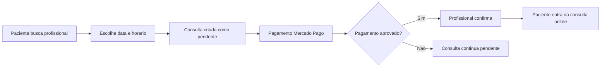

# MedFlow

MedFlow e um app mobile de saude digital que conecta pacientes e profissionais para consultas online. A proposta e deixar o caminho inteiro mais simples: o paciente encontra um profissional, escolhe um horario real da agenda, paga a consulta e acompanha o atendimento; o profissional organiza disponibilidade, recebe solicitacoes, confirma consultas pagas e abre o link da videochamada.

O projeto foi construido com foco em produto real: perfis diferentes para paciente e profissional, regras de acesso no banco, fluxo de pagamento, persistencia de sessao e uma experiencia mobile direta.

## Destaques

- Cadastro e login com Supabase Auth.
- Separacao de jornada entre paciente e profissional.
- Busca de profissionais por nome ou especialidade.
- Perfil profissional com especialidade, CRM, bio, preco e link de consulta.
- Agenda semanal configuravel pelo profissional.
- Agendamento em etapas: detalhes, data, horario e confirmacao.
- Bloqueio de horarios ja reservados para evitar conflito.
- Pagamento integrado com Mercado Pago.
- Status de consulta e pagamento acompanhados no app.
- Acesso a consulta online por link configurado pelo profissional.
- Row Level Security no Supabase para proteger dados por usuario.

## Problema Que O App Resolve

Muitos atendimentos online ainda dependem de mensagens soltas, planilhas, comprovantes enviados manualmente e confirmacoes demoradas. O MedFlow centraliza esse fluxo em uma experiencia unica:

1. O profissional cadastra seus dados e horarios disponiveis.
2. O paciente encontra um profissional e escolhe um horario livre.
3. O app cria a consulta e direciona para pagamento.
4. A consulta fica pendente ate o pagamento ser aprovado.
5. O profissional confirma e o paciente acessa o link da consulta.

## Fluxos Principais

### Paciente

- Cria conta ou faz login.
- Busca profissionais cadastrados.
- Visualiza especialidade, bio, valor e disponibilidade.
- Agenda uma consulta em poucos passos.
- Realiza o pagamento pelo Mercado Pago.
- Acompanha consultas proximas, concluidas ou canceladas.
- Entra na consulta quando ela estiver confirmada.

### Profissional

- Cria conta com nome, especialidade e CRM.
- Completa o perfil com bio, preco e link de atendimento.
- Define horarios disponiveis por dia da semana.
- Visualiza consultas pendentes e confirmadas.
- Confirma consultas somente apos pagamento.
- Inicia o atendimento pelo link configurado.

## Como O Fluxo Funciona



## Stack

| Camada | Tecnologias |
| --- | --- |
| Mobile | React Native, Expo, Expo Router, TypeScript |
| UI | NativeWind, Tailwind CSS, componentes proprios |
| Estado e dados | React Query, hooks customizados |
| Auth e banco | Supabase Auth, Supabase Postgres |
| Backend | Node.js, Express, tRPC |
| Pagamentos | Mercado Pago Checkout e endpoints Pix |
| Qualidade | Vitest, TypeScript, ESLint |

## Arquitetura Do Projeto

```text
app/                         Rotas e telas do Expo Router
app/auth/                    Login e cadastros
app/(tabs)/patient/          Area do paciente
app/(tabs)/professional/     Area do profissional
components/ui/medflow.tsx    Componentes visuais reutilizaveis
hooks/use-unified-auth.ts    Autenticacao centralizada com Supabase
lib/medflow-supabase.ts      Regras de negocio e acesso ao Supabase
lib/mercado-pago.ts          Cliente mobile para fluxo de pagamento
server/_core/payments.ts     Rotas backend do Mercado Pago
supabase/schema.sql          Tabelas, views, triggers, indices e RLS
tests/                       Testes automatizados com Vitest
```

## Banco De Dados

O schema principal fica em `supabase/schema.sql` e usa:

- `auth.users`: usuarios autenticados pelo Supabase.
- `public.professionals`: perfil publico/comercial do profissional.
- `public.availability`: horarios disponiveis por profissional.
- `public.appointments`: consultas, status e metadados de pagamento.

Tambem existem views administrativas para facilitar leitura no painel do Supabase:

- `patient_accounts`
- `professional_accounts`
- `appointments_overview`

As tabelas principais usam Row Level Security para garantir que cada usuario veja e altere apenas os dados permitidos.

## Rodando Localmente

Instale as dependencias:

```bash
pnpm install
```

Configure as variaveis de ambiente:

```bash
VITE_SUPABASE_URL=
VITE_SUPABASE_ANON_KEY=
EXPO_PUBLIC_API_BASE_URL=
MERCADO_PAGO_ACCESS_TOKEN=
MERCADO_PAGO_WEBHOOK_URL=
EXPO_PUBLIC_MERCADO_PAGO_PUBLIC_KEY=
```

Prepare o banco executando o arquivo `supabase/schema.sql` no SQL Editor do Supabase.

Inicie o app e o backend em desenvolvimento:

```bash
pnpm dev
```

Outros comandos uteis:

```bash
pnpm dev:web
pnpm test
pnpm check
pnpm lint
```

## Testes

O projeto inclui testes para regras importantes do agendamento, como:

- formatacao e leitura de datas sem deslocar o dia;
- geracao de horarios a partir da disponibilidade;
- filtro de horarios ja reservados.

Execute com:

```bash
pnpm test
```

## Status Do Projeto

O MedFlow ja possui os principais fluxos funcionais de uma plataforma de consultas online: autenticacao, perfis, agenda, agendamento, pagamento e acompanhamento de consultas.

Proximas melhorias planejadas:

- webhook completo para atualizacao automatica de pagamento;
- notificacoes para paciente e profissional;
- avaliacoes apos consulta;
- historico clinico ou observacoes do atendimento;
- painel administrativo mais completo.

## Aprendizados

Este projeto explora desafios comuns de um produto real:

- modelagem de usuarios com papeis diferentes;
- sincronizacao entre dados de auth e perfil publico;
- protecao de dados com RLS;
- consistencia de agenda e prevencao de conflitos;
- integracao de pagamento externo;
- arquitetura mobile com backend auxiliar.

## Autor

Desenvolvido por Jonann como projeto de portfolio.
